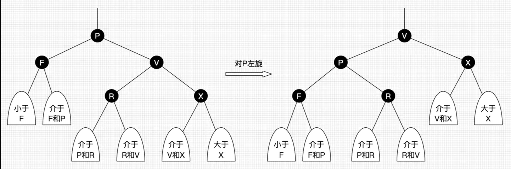
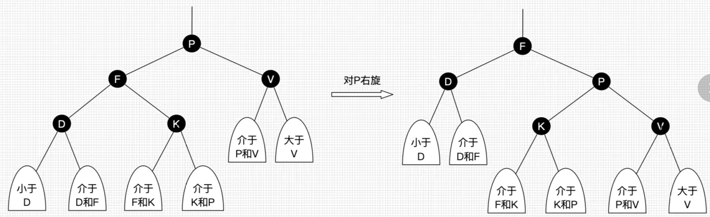
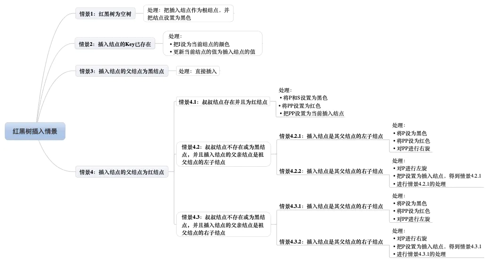
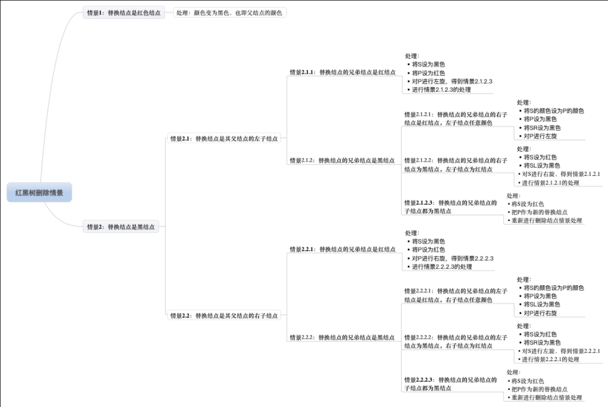

## 5 个性质

1. 每个节点非黑即红
2. `根叶`结点是黑色
3. `根叶`结点是黑色
4. 每个`红色节点`的`两个子节点一定是黑色`
5. 任意节点到每个叶子节点的路径包含`相同数量的黑色节点`(我们叫红黑树的这种平衡为`黑色完美平衡`)
   1. 如果一个节点有`黑子节点`，那么该节点肯定`有两个子节点`

## 左右旋

### 左旋

左旋只影响旋转结点和其`右子树`的结构，把右子树的结点往左子树挪了，`左加右减`

### 右旋

右旋只影响旋转结点和其`左子树`的结构，把左子树的结点往右子树挪了, `右加左减`

### 查找

红黑树就是一棵二叉搜索树，并且查找不会破坏二叉树的平衡，所以查找跟普通的二叉搜索树无异

### 插入

插入包含两部分工作：`查找插入位置`，`插入后自平衡`
插入位置就是查找，插入后自平衡才是重心

注： 插入的节点是`红色`,理由：红色节点在父节点为黑色时，红黑树的黑色平衡没被破坏，不需要自平衡操作。但是如果插入的节点是黑色，那么插入位置所在的子树中，黑色节点总是+1，必须做自平衡。

### 删除

